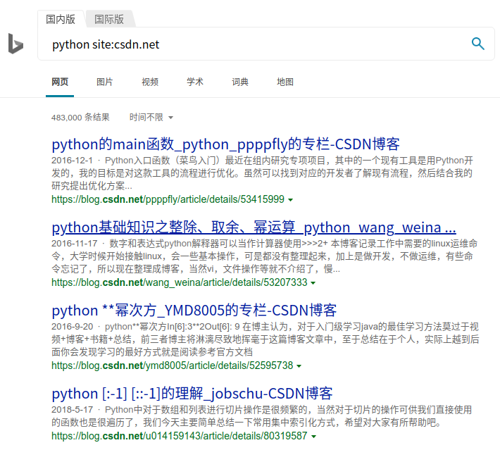
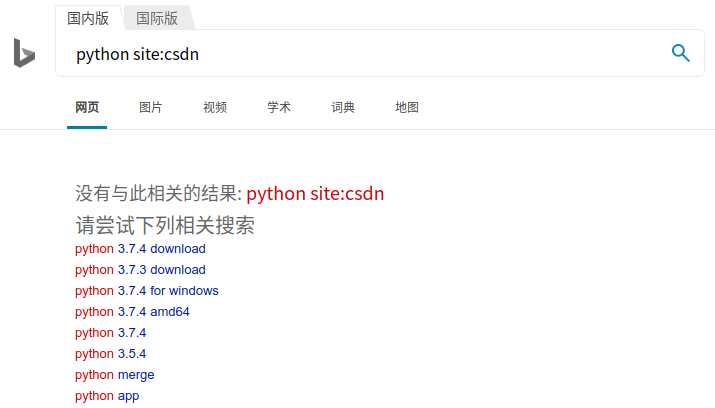
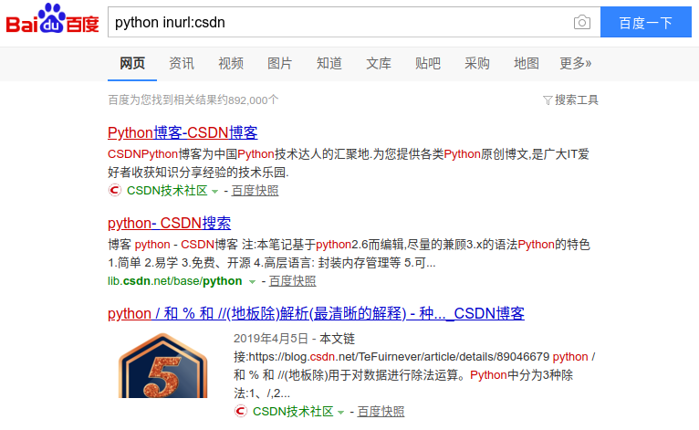

## 1.3 面向搜索编程

在1.1节我们说作为一名自学者需要擅用搜索引擎，对于编程的初学者尤其重要。你不可能指望像学校里一样有老师给你解答疑惑，也不可能指望一本书籍能教会你所有知识。你需要依靠自己和强大的搜索引擎在丰富的网络资源中探索学习。互联网本身天然就带有自由、共享的精神，互联网上的编程学习资源可能比任何一所大学的计算机专业还要强大。所以，我们需要学会面向搜索编程。

### 在哪里搜索？

如果有条件推荐在[Google](http://www.google.com)上搜索，相比国内的搜索引擎更容易搜索到你想要的答案。如果用不了Google，国内推荐使用[Bing](http://www.bing.com)(必应)搜索，相对于百度还是要准确不少。你有任何疑难杂症都可以在里面寻找答案。

在搜索引擎里搜索的时候，一些比较好的论坛社区的文章也会包含进来，如：CSDN、开源中国、博客园等。所以不喜欢逛论坛的直接在搜索引擎里搜索也没有问题，如果看到一些比较好的文章的作者，可以再关注，详细看作者其他的文章。

如果你的疑难杂症中文搜索不到的时候，尝试用英文描述问题搜索，或者用英文在[Stack Overflow](https://stackoverflow.com/) 里搜索，通常能够找到解决方法。英文不好怎么办？不会的单词用翻译软件查，输入几个关键词就行。不会就学，没有太多的捷径，查多了就感觉不到太大的阻碍。

现在微信公众号也有大量的好文章，有时用微信的搜一搜也会有意外的惊喜。同样的知乎也可以尝试下。当然，学习编程还有个最大的宝库就是[GitHub](https://github.com/) ，这是全球最大的程序代码交流社区，有无数别人造好的轮子，你可以利用别人造好的轮子，也可以学习别人优秀的代码。由于GitHub如此重要，所以每个编程学习者都应该掌握，我们在1.4节再讨论Git和GitHub的具体用法。

如果想找免费的书籍系统学习，英文书可以用[Library Genesis](http://gen.lib.rus.ec/) ，中文的可以用[鸠摩搜书](https://www.jiumodiary.com/) ，基本上有的书都能够找到。如果想找免费的视频课程，国内可以用[bilibili](https://www.bilibili.com/) ，里面有很多优质课程。

### 常用搜索技巧

**site: 指定网址中搜索** 

当你只想要某个网站的搜索结果的时候就在结尾或开头加上site关键词和对应网址。例如：

`python site:csdn.net`

搜索结果就只会出现CSDN社区中关于Python的文章，如图1.3-1所示。

 

**inurl: 模糊指定网址中搜索** 

前面我们用`site:`筛选出指定网址的内容，这里的网址是需要完整的网址，但是假如我记不住完整的网址怎么办？比如CSDN社区我不清楚它究竟是.com后缀还是.net后缀，我只用csdn来指定会出现什么结果？

 

由图1.3-2可以看出这样搜索不出来任何结果。而如果采用`inurl:`来指定网址就可以达到我们想要的效果，它不需要输入完整的网址，会在包含该关键词的网址中进行搜索，效果如图1.3-3所示。

 

> 注：Bing不支持该语法，Baidu和Google支持。

**filetype: 指定搜索文件类型** 

有时我们想找PDF、Word、epub等指定文件的时候，就可以用这个关键词来限定，例如我想搜索SQL有关的PDF文件，如图1.3-4所示：

 

这样的搜索技巧有10多条，笔者平常使用频率最高的也就是这三条，很多时候更多的是需要更换、拆分搜索的关键词来检索出你想要的结果。最后给大家布置一个小作业，通过这个小作业，大家自己来学会常用的搜索引擎使用技巧。

> 作业：
>
>1. 在搜索引擎中搜索：**Google搜索技巧** 。
>2. 在搜索引擎中搜索：**Google search tips** 。

希望通过这个小作业读者能掌握搜索技巧并对比下同一个问题用中文和英文分别搜索出的结果质量差异。
