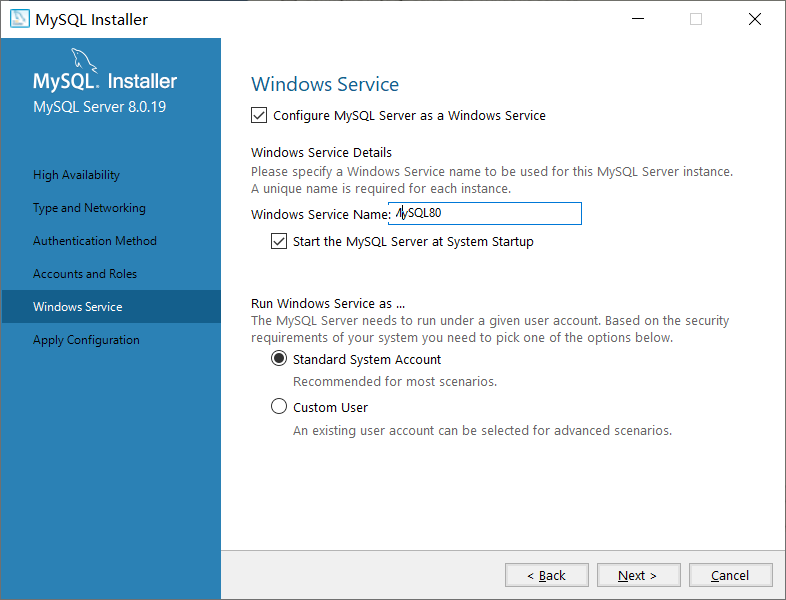

随着企业信息化的发展，财务数据、业务数据在数据量级上不断增长。对于一些大型制造业、金融行业、互联网行业、电信行业、以及以共享单车为代表的共享经济为模式的企业，对其进行数据分析如果还采用传统的Excel，是根本行不通的。

我们需要处理的数据量级，由以前的KB，MB变化到GB、TB。这个时候，我们就需要借助数据库、数据仓库。数据库，又称为数据管理系统，简而言之可视为电子化的文件柜——存储电子文件的处所，用户可以对文件中的数据运行新增、截取、更新、删除等操作。为便于理解，我们可以认为数据库就是一个存放数据的场所，类似平时大家使用的办公软件Excel的工作簿。

本章我们将以免费的MySQL数据库为工具，学习数据库的通用语言SQL。

## 2.1 MySQL安装

企业采用的关系型数据库一般常见的有Oracle、SQL Server、MySQL等，而操作这些数据库背后有一套通用语言:SQL。不同数据库间，只有一些语句的微小差异。因此只要我们掌握了SQL的基本语句，就掌握了数据分析的基本方法，不会再为Excel处理不了，数据跑不动而困扰。令人惊喜的是SQL语句出其的简单易学，一个完全没有基础的朋友也能在短短几周之内学会基本的查询语句，达到进行数据分析的水平。SQL的易学程度甚至比Excel办公软件中的函数更容易，如果读者之前不太了解SQL，完全不用担心，跟着我们完成从0到1的学习之旅。

首先我们到[MySQL官网](https://www.mysql.com/downloads/)的下载栏目找到最下方的社区版的下载链接,如图2.1-1所示。

 

选择**MySQL Installer for Windows**,下载最新版本安装包，如图2.1-2所示。如果需要下载历史版本，点击**Archives**下载对应版本。

 

在下载页面，我们选择较大的398.9M的离线安装包进行下载，如图2.1-3所示。

 

完成下载后,接下来我们双击安装包进行MySQL的安装。

 

如图2.1-4所示，选择第二项“Server only”，代表着我们仅安装MySQL的服务端，当然默认安装第一项也是可以，只是会安装一些其他软件。选择完成后，点击“Next”。

 

如图2.1-5所示，进入安装前环境检查，这里有可能会弹出“Microsoft Visual C++ 2019 Redistributable Package(x64) is not installed”。我们只需要搜索部分关键字，进入[下载页面](https://visualstudio.microsoft.com/zh-hans/downloads/?rr=https%3A%2F%2Fsupport.microsoft.com%2Fzh-cn%2Fhelp%2F2977003%2Fthe-latest-supported-visual-c-downloads)，在网页最下方的“其他工具和框架”栏目进行下载安装，如图2.1-6所示。

 

安装完成后，再在MySQL安装界面点击“Next”。

 

如图2.1-7所示，默认点击“Next”。

 

如图2.1-8所示，默认选择“Standalone MySQL Server”，点击“Next”。

 

如图2.1-9所示，默认配置，点击“Next”。这里“Config Type”默认为我们使用方式是开发电脑。下面选项是使用“TCP/IP”协议访问数据库，访问端口是“3306”。

 

如图2.1-10所示，我们选择第二项“Use Legacy Authentication Method”，这里如果选择第一项，将采用MySQL 8新的加密认证方式，而我们后面需要使用第三方的图形化工具访问MySQL，所以为了能正常访问，我们选择第二种旧的认证方式。

 

如图2.1-11所示，我们默认配置，这里是将MySQL Server作为Windows服务，并默认MySQL Server开机启动。点击“Next”。

 

如图2.1-12所示，点击“Execute”，执行完后点击“Finish”。

 

如图2.1-13所示，点击“Next”，完成最后的配置后，整个MySQL的安装就完成了。为了检验我们是否成功安装MySQL Server，我们在桌面点击“Windows 开始”，运行刚安装的“MySQL 8.0 Command Line Client-Unicode”，如图2.1-14所示。

 

 

如图2.1-15所示，输入前面安装过程中设置的密码后，如果出现欢迎界面，就表示安装成功了。我们已经进入了数据库操作的界面，可以输入SQL语句执行增、删、查、改操作，但是这个界面对于大部份人来说并不友好。所以下一节，我们会安装图形化的数据库管理软件，更加方便直观的操作数据库。
