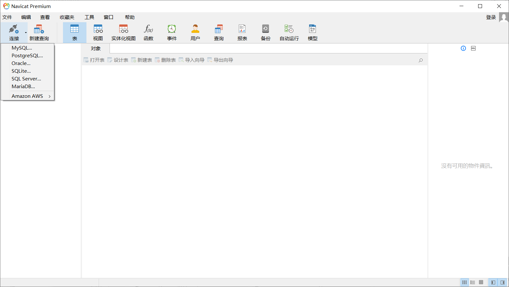
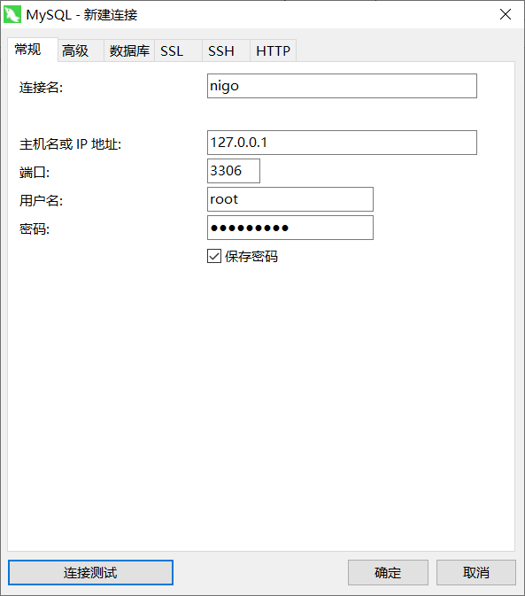
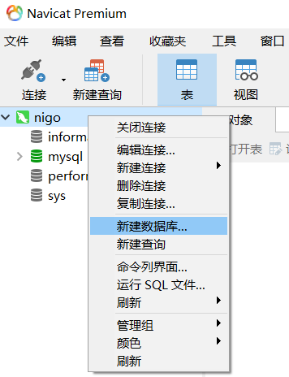
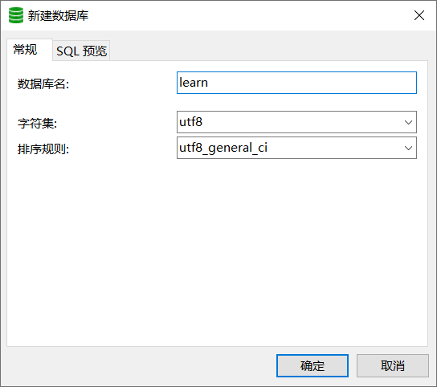

## 2.2 Navicat配置

上一节，我们安装好了MySQL Server，要访问MySQL除了使用黑乎乎的终端外，我们更需要一个简单、直观的图形化工具。MySQL的图形化工具市面上主要有以下几种：

|软件|是否免费|Windows|Mac|Linux|
|--|--|--|--|--|
|Navicat|付费|Y|N|N|
|MySQL Workbench|免费|Y|Y|Y|
|DBeaver|免费|Y|Y|Y|
|HeidiSQL|免费|Y|N|N|

以上四款软件为笔者测试后感觉还比较好使用的图形化工具，均支持语法提示，这一点对于初学者挺重要，不需要你去记忆SQL语句。Navicat应该是所有软件中功能最强大的，支持了Excel、CSV、TxT格式的数据导入，这极大方便了初学者需要频繁导入外部数据进行分析的需求，但是软件是付费的并且不便宜，网络上能够找到绿色版本。MySQL Workbench是MySQL推出的官方图形化管理工具，支持全平台。DBeaver也是一款免费的全平台数据库管理工具。对于免费的软件推荐使用MySQL Workbench和DBeaver。这些软件都支持CSV格式数据的图形化导入导出，考虑到Navicat支持导入导出格式更多，对于零基础用户更友好，因此下面我们主要以Navicat为主介绍相应操作。

### 连接MySQL

 

如图2.2-1所示，点击“连接”，“MySQL”。

 

如图2.2-2所示，填写连接信息，与上节我们安装的MySQL Server建立连接。

* 连接名：这里给连接自定义一个名称，比如我取名为“nigo”。
* 主机名或IP地址：如果是连接我们本机安装的MySQL，就填写“127.0.0.1”，这是本机默认的IP地址。如果是连接远程服务器，那么就填写对应的IP地址。
* 端口：填写数据库端口，默认是“3306”。
* 用户名：填写“root”，这是数据库的超级用户。
* 密码：填写用户名对应密码，上一节我们安装MySQL时设置过的密码。

填写完毕后，可以点击“连接测试”，看我们填写参数是否可以成功连接。无误后，点击“确定”。

 

如图2.2-3所示，我们可以看到有一个连接“nigo”，下面有四个安装MySQL后自带的数据库。为了方便后面我们学习，我们先新建一个数据库“learn”，操作为，右键单击连接名（这里是图中的“nigo”），点击“新建数据库”。

 

如图2.2-4所示，填写数据库参数如下：

* 数据库名：自定义数据库名称，如“learn”。
* 字符集：字符编码，因为我们后面使用的数据可能包含中文，因此选择“utf8”。
* 排序规则：utf8_general_ci

至此，我们对Navicat必要的配置就完成了，具体的使用在后面我们结合数据再进行讲解。其功能也比较简单直观，动手摸索下大部分功能都能知道如何使用。
