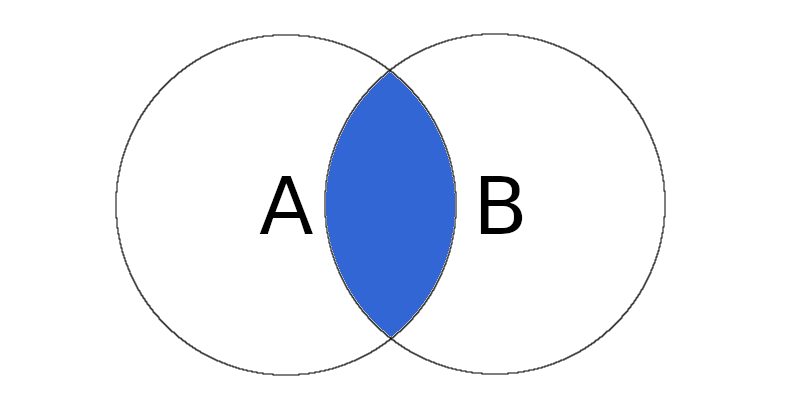
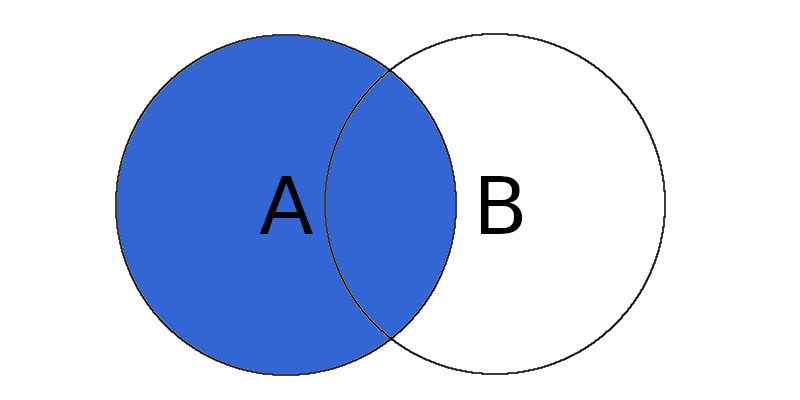
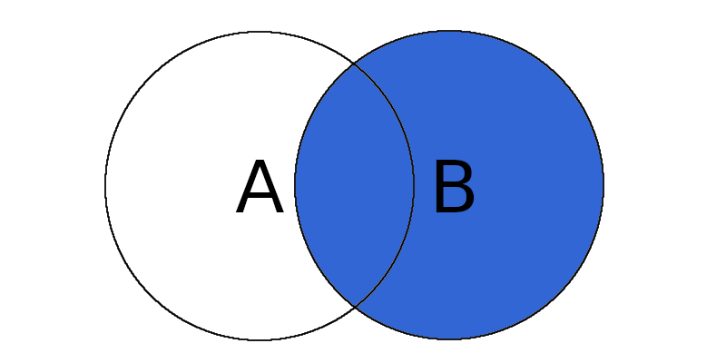
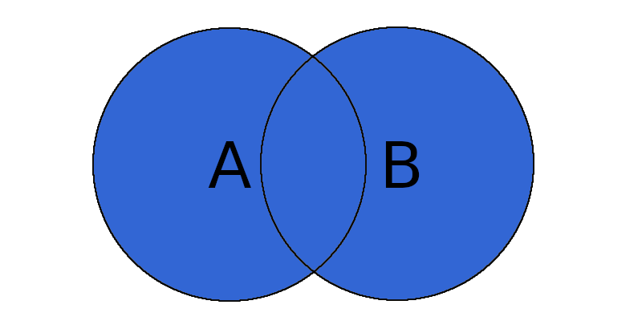
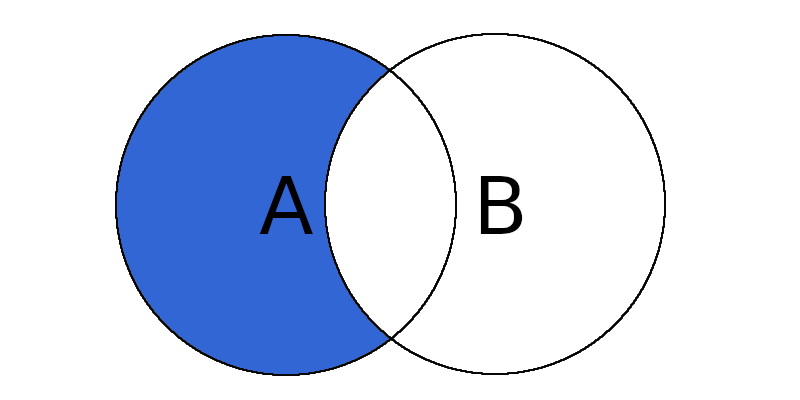
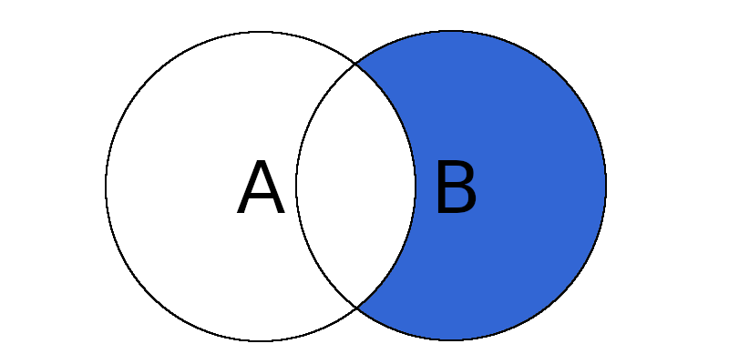
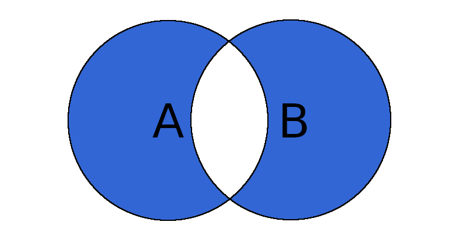

## 2.5 SQL查询

对于财务、审计等需要进行数据分析的岗位，仅仅需要运用SQL查询语句而不会去删除或新增数据。因此，我们将以2.3节导入数据库中的“ecommerce”表为练习素材，学习SQL常用的查询语句。这段学习旅途不会很困难，因为SQL查询语句很少，并且直观易懂。对于初学者，希望每一个语句都能自己在Navicat中运行一遍，这样才可能真正的掌握。

在具体学习之前有几个问题我们需要搞清楚：

**如何注释？**

学习任何一门语言之前，我们都需要搞清楚注释语句，也就是说这条语句不会被执行，你可以备注一些解释说明的文字。

* 行注释：两个短横线`-- `
* 块注释：`/*   */`

**如何调试？**

当我们写好了一条SQL语句，在Navicat中可以点击运行（快捷键Ctrl+R)。如果写了多条语句，每条语句是用分号（;)隔开的，执行其中一条语句，可以鼠标选择后，点击选中语句运行（快捷键Ctrl+Shift+R）。运行后我们常常会看到报错提示，也就是说我们语句某个地方并不正确，这个时候你可以看到提示的第几行有错，以及错误原因描述，再去检查对应的地方。刚开始学时你写了一条复杂的语句运行报错的时候，你可以将语句简化下，运行无误再增加条件，这样是可以慢慢找到错误原因的。当然你也可以将提示的错误描述，在网络上搜索，有些问题可以解决。

除此之外，你应该还记得SQL是大小写不敏感的，在Navicat中输入语句的时候会有智能提示，按Tab键可以补全语句。有了这些基础，我们就可以开始学习具体的查询语句了。

下面我们还是以2.3节中导入的ecommerce表作为练习例子，读者可以从附件资源中下载导入数据库后，跟着一起操作。ecommerce表结构如下：

|Invoice|StockCode|Description|Quantity|InvoiceDate|UnitPrice|CustomerID|Country|
|--|--|--|--|--|--|--|--|
|536365|85123A|WHITE HANGING HEART T-LIGHT HOLDER|6|12/1/2010 8:26|2.55|17850|United Kingdom|
|536370|22492|MINI PAINT SET VINTAGE |36|12/1/2010 8:45|0.65|12583|France|
|...|...|...|...|...|...|...|...|


**SELECT 语法**
```SQL
SELECT 列名称 FROM 表名称
```

如果想从ecommerce表中获取CustomerID,UnitPrice,Quantity三列数据，那么我们可以写SQL语句：

```SQL
select CustomerID,UnitPrice,Quantity from ecommerce
```

执行结果：

|CustomerID|UnitPrice|Quantity|
|--|--|--|
|17850|2.55|6|
|12583|0.65|36|
|...|...|...|


如果我想选取所有列的数据，是不是需要把所有列名都写一遍？答案是不用的。我们可以用`*`来表示所有列，因此可以写SQL语句：
```SQL
select * from ecommerce
```

**SELECT DISTINCT 语法**

```SQL
SELECT DISTINCT 列名称 FROM 表名称
```

在一张表中某一行常常包含重复值，而我们想要筛选出不重复的值只需要使用`DISTINCT`。例如，在ecommerce表中，我想查看销售的不同的国家有哪些，那么可以写SQL语句：
```SQL
select distinct Country from ecommerce
```

执行结果：

|Country|
|--|
|United Kingdom|
|France|
|Australia|
|...|

如果想筛选出每个不同的用户（CustomerID)来自哪个国家（Country)，那么可以写SQL语句：
```SQL
select distinct CustomerID, Country from ecommerce
```
执行结果：
|CustomerID|Country|
|--|--|
|17850.0|United Kingdom|
|13047.0|United Kingdom|
|12583.0|France|
|...|...|

可以看到CustomerID是保证不重复的，而没有加distinct的Country是允许相同的。

**WHERE 子句**

```SQL
SELECT 列名称 FROM 表名称 WHERE 列 运算符 值
```

前面用select都是筛选出整个列的数据数据，但是很多时候，我们都是需要筛选出满足某些特定条件的数据，这个时候就需要用到where子句，添加一些限制条件。而限制条件的添加就需要用到运算符：

|运算符|描述|
|--|--|
|=|等于|
|<>|不等于|
|>|大于|
|<|小于|
|>=|大于等于|
|<=|小于等于|
|BETWEEN|在某个范围内|
|IN|在几个值范围内|
|LIKE|模糊搜索|

例如，查找发票号（InvoiceNo）等于536368的所有数据，可以写SQL语句：
```SQL
select * from ecommerce
where InvoiceNo=536368
```
查找单笔销售数据大于等于1000的商品信息，可以写SQL语句：

```SQL
select * from ecommerce
where Quantity>=1000
```
查找销售日本的商品信息，可以写SQL语句：

```SQL
select * from ecommerce
where Country='Japan'
```

需要注意的是，对于文本类型的数据我们需要用单引号或双引号来包裹值，如Japan我们给它加了单引号。而对于数字类型的值我们不要添加引号。

当我们想查找某个范围内的值的时候可以使用between运算符，例如，查找所有单价（UnitPrice)在10～20之间的数据，可以写SQL:

```SQL
select * from ecommerce
where UnitPrice between 10 and 20
```

当然也可以运用前面的尝过的知识，写成：

```SQL
select * from ecommerce
where UnitPrice>=10 and UnitPrice<=20
```

这里的`and`是“且”的意思，可以把两个条件组合在一起，相对应的`or`是“或”的意思。除了`between`是在一个范围区间内查找外，我们也可以用`in`在几个值之间查找。例如，想筛选出France、Australia、Germany三个国家的信息，我可以写SQL语句：

```SQL
select * from ecommerce
where Country in ('France','Australia','Germany')
```

常常我们有筛选出包含某个关键字的信息，但具体值我并不清楚，也就是说我不能使用`=`来作为运算符，这个时候，我们可以用`like`来进行模糊搜索。例如，查找商品描述（Description）中包含“PENCIL”字样的所有数据，我们可以写SQL语句：

```SQL
select * from ecommerce
where Description like '%PENCIL%'
```

需要注意的是我们用`%PENCIL%`来表示包含PENCIL的所有文本，这里的`%`是通配符，可以表示任意长度的字符串。除了`%`外，通配符还有`_`，表示仅替代一个字符。例如，用`_rance`可以代表`France`。除了`like`使用到这两个通配符外，MySQL支持的正则表达式也有一些通配符，由于 使用频率不高，这里就不展开了。

**ORDER BY 子句**

where子句是通过添加限制条件进行筛选数据，而order by子句就是根据指定的列结果集进行排序。order by默认是升序，加上desc是降序。例如，对ecommerce表销售法国的订单按单价（UnitPrice)降序排列，可以写SQL语句：

```SQL
select * from ecommerce
where Country='France'
order by  UnitPrice desc
```

需要注意的是，order by需要写在where子句后面，其是在`select from where`执行完后的数据集做排序操作。如果是升序排列就去掉`desc`关键词。

**合计函数**

通常我们需要计算一列的最大值、最小值、平均值等，这就需要运用合计函数：

|函数|描述|
|--|--|
|SUM|求和|
|MAX|最大值|
|MIN|最小值|
|AVG|平均值|
|COUNT|计数|

例如，查找商品最大单价（UnitPrice)，可以写SQL语句：

```SQL
select max(UnitPrice) from ecommerce
```

例如，求销售合计=单价（UnitPrice)*数据（Quantity）之和，可以写SQL语句：

```SQL
select sum(UnitPrice*Quantity) from ecommerce
```

例如，求ecommerce表中订单行数，可以写SQL语句：

```SQL
select count(*) from ecommerce
```

需要注意的是count(列名)统计有多少个列的值，不含NULL，count(*)直接统计行数。

**GROUP BY 语句**

group by是对一列或多列分组，通常与合计函数结合来求最大值，最小值，平均值等。前面我们通过合计函数sum求所有订单的销售合计，如果我们想安装国家（Country）分组，分别求其销售合计，,并按销售金额由大倒小排序，可以写SQL语句：

```sql
select Country, sum(UnitPrice*Quantity) as 合计
from ecommerce
group by Country
order by 合计 desc
```

执行结果：

| Country        | 合计               |
| -------------- | ------------------ |
| United Kingdom | 8187806.364001113  |
| Netherlands    | 284661.54000000015 |
| EIRE           | 263276.81999999826 |
| Germany        | 221698.20999999862 |
| France         | 197403.90000000002 |
| ...            | ...                |

`sum(UnitPrice*Quantity) as 合计`这里我们使用了`as`来将`sum(UnitPrice*Quantity)`计算值重命名为`合计`。重命名我们会经常使用，通过对于字段或表名称比较复杂时，通过重命名简写，从而方便输写SQL语句。在重命名后，最后`order by`排序语句就可以直接利用得命名后的`合计`代替原来较复杂的语句。

执行的结果里，运算的数字有很多位小数，如果我只想保留两位小数，可以使用`format()`函数进行格式化：

```sql
select Country, format(sum(UnitPrice*Quantity),2) as  合计
from ecommerce
group by Country
order by 合计 desc
```

执行结果：

| Country        | 合计         |
| -------------- | ------------ |
| Singapore      | 9,120.39     |
| United Kingdom | 8,187,806.36 |
| Czech Republic | 707.72       |
| Israel         | 7,907.82     |
| Poland         | 7,213.14     |
| ...            | ...          |

​	可以看到数字的小数位数保留两位。format的语法为`FORMAT(column_name,format)`。不知道大家有没有发现一个问题，就是按合计金额大小排序已经乱了，它把合计数默认为文本进行了排序。原因就是format函数，返回的数据类型为字符串。现在我们换一种方式，使用convert转换函数，写SQL语句：

```sql
select Country, convert(sum(UnitPrice*Quantity),decimal(38,2))  合计
from ecommerce
group by Country
order by 合计 desc
```

执行结果：

| Country        | 合计       |
| -------------- | ---------- |
| United Kingdom | 8187806.36 |
| Netherlands    | 284661.54  |
| EIRE           | 263276.82  |
| Germany        | 221698.21  |
| France         | 197403.9   |
| ...            | ...        |

可以看到现在小数位数是两位，排序也是正确了。这里`convert(列，数据类型)`就是将一列的数据类型进行转换，我们将合计数计算结果转换为decimal(38,2)数字类型，38代表小数点左边和右边可以存储的最大位数，2代表小数点右边可以存储的的最大位数。

**LIMIT 子句**

limit子句用于规定要返回的记录的数目。很多时候我们用SQL语句排序后，仅想找前面几条数据，而不是所有数据，那么就需要用limit限制返回的数目。比如上一例，我们求每个国家的销售合计，会返回所有国家的记录，如果我只想要销售合计金额前三的国家，可以写SQL语句：

```sql
select Country, convert(sum(UnitPrice*Quantity),decimal(38,2))  合计
from ecommerce
group by Country
order by 合计 desc
limit 3
```
执行结果：

| Country        | 合计       |
| -------------- | ---------- |
| United Kingdom | 8187806.36 |
| Netherlands    | 284661.54  |
| EIRE           | 263276.82  |

**HAVING 子句**

我们在学习where子句的时候，用它来添加限制条件，筛选出需要的数据。但是where子句并不能与合计函数一起使用。比如前面例子中我们求各个国家的销售合计数，如果我想筛选出合计数大于20万的国家，这个时候我们就不能使用where子句，而需要使用having子句：

```sql
select Country, convert(sum(UnitPrice*Quantity),decimal(38,2))  合计
from ecommerce
group by Country
having 合计>=200000
order by 合计 desc
```

`having 合计>=200000`中我们对合计函数`convert(sum(UnitPrice*Quantity),decimal(38,2))`进行条件限制。对于多条件的我们同样的可以使用`and`、`or`进行条件组合。

**JOIN 表连接**

前面我们所学的查询`select  列名称 from 表名称`都是从一张表中查询数据，但很多情况下，我们需要从两张或多张表中获取数据，并且这些表中有共同的字段使得多张表可以连接起来。对于多表查询，我们需要使用`JOIN`语句。

为了便于读者理解，这里我们先在数据库中创建两张表A、B：

| id | value | 
|:---|:------|
| 1  | v1    | 
| 2  | v2    | 

| id | value | 
|:---|:------|
| 2  | v2    | 
| 3  | v3    | 

表A包含id为1,2的两个数据，表B包含id为2,3两个数据。两张表可以通过id连接起来。

 

如图2.5.1所示，**inner join**内连接，查找A、B两个集合的交集。

```sql
select A.id,A.value,B.id,B.value
from A join B on A.id=B.id
```

执行结果：

|id|value|id|value|
|--|--|--|--|
|2|v2|2|v2|

 

如图2.5.2所示，**left join**左连接，查找A集合中所有元素，也就是说即使B集合中没有匹配，也从A表中返回所有的行。

```sql
select A.id,A.value,B.id,B.value
from A left join B on A.id=B.id
```

执行结果：

|id|value|id|value|
|--|--|--|--|
|2|v2|2|v2|
|1|v1|NULL|NULL|

可以看到B表中没有元素id=1,返回值为空值NULL。

 

如图2.5.3所示，**right join**右连接，查找B集合中所有元素，也就是说即使A集合没有匹配，也从B表中返回所有的行。

```SQL
select A.id,A.value,B.id,B.value
from A right join B on A.id=B.id
```

执行结果：

|id|value|id|value|
|--|--|--|--|
|2|v2|2|v2|
|NULL|NULL|3|v3|

 

如图2.5.4所示，**full outer join**外连接，查找A、B集合的全集。但在mysql中并没有`full outer join`语句，我们需要通过`left join`和`right join`拼接而成。

```sql
select A.id,A.value,B.id,B.value
from A left join B on A.id=B.id
union
select A.id,A.value,B.id,B.value
from A right join B on A.id=B.id
```

执行结果：

|id|value|id|value|
|--|--|--|--|
|2|v2|2|v2|
|1|v1|NULL|NULL|
|NULL|NULL|3|v3|

这里我们拼接`left join`和`right join`时，使用了`union`操作符，它的作用是合并两个或多个select语句的结果集。

以上四种语句是我们在SQL中使用join常见的类型，但从集合的角度上看，我们还可以延伸出3种情况，而这三种情况在我们IT审计中对比两个数据是否一致时，常常用到。

 

如图2.5.5所示，查找A表中有，而B表中没有的数据。这在我们找两个数据集差异的时候，非常实用。

```sql
select A.id,A.value,B.id,B.value
from A left join B on A.id=B.id
where B.id is null
```
执行结果：

|id|value|id|value|
|--|--|--|--|
|1|v1|NULL|NULL|

 

如图2.5.6所示，查找B表中有，而A表中没有的数据。

```sql
select A.id,A.value,B.id,B.value
from A right join B on A.id=B.id
where A.id is null
```


执行结果：

|id|value|id|value|
|--|--|--|--|
|NULL|NULL|3|v3|

 

如图2.5.7所示，查找A、B集合的差集。当我们想找出两个数据集所有差异的数据明细时，常常用到。

```sql
select A.id,A.value,B.id,B.value
from A left join B on A.id=B.id
where B.id is null
union
select A.id,A.value,B.id,B.value
from A right join B on A.id=B.id
where A.id is null
```


执行结果：

|id|value|id|value|
|--|--|--|--|
|1|v1|NULL|NULL|
|NULL|NULL|3|v3|

在数据分析过程中，当我们找到了两个数据所有的差异明细后，就可以一条一条数据去分析原因。

至此，SQL查询常用的基础语句就介绍完了，可以看到其实SQL语句内容并不是很多，如果只是进行一些简单的数据分析是可以很快上手的。在下一节，我们会利用本节所学的语句进行练习，让大家能够尽快掌握。最后，列示一下上述SQL语句在执行过程中的先后顺序。

| 语句     | 顺序 | 
|:---------|:-----|
| FROM     | 1    | 
| ON       | 2    | 
| JOIN     | 3    | 
| WHERE    | 4    | 
| GROUP BY | 5    | 
| HAVING   | 6    | 
| SELECT   | 7    | 
| DISTINCT | 8    | 
| ORDER BY | 9    | 
| LIMIT    | 10   | 

