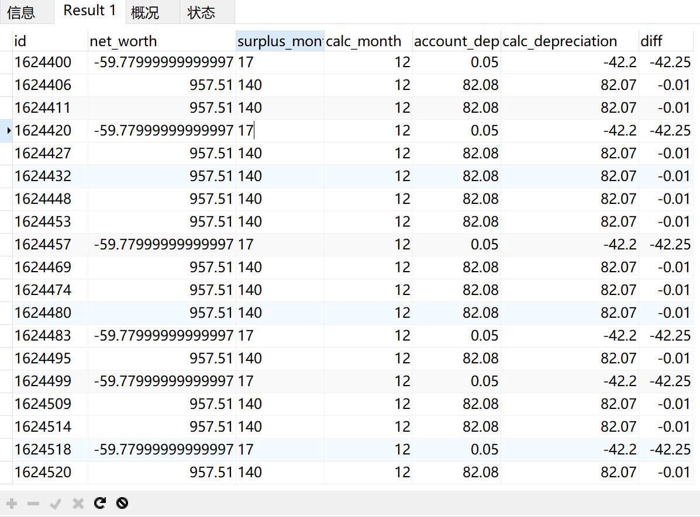

我们通过第二章的学习，已经具备了利用SQL进行数据分析的必备知识，可能并不全面，但在实际工作中，遇到具体问题再网上搜索相关资料，一般都能够达到目的。而发现问题-检索-解决问题的模式也是我们快速学习的方法。SQL查询语句内容并不多，稍微复杂一点的数据分析逻辑我们可以通过简单语句的嵌套完成，特别复杂的逻辑我们会使用高级编程语言来完成而不是用SQL。所以我们使用SQL的场景都不会特别复杂，本章我们就利用项目数据作为练习，通过一些实际案例来掌握前面所学的基础知识，同时学会如何利用SQL来解决数据分析的问题。

## 3.1 固定资产折旧计算

**项目背景**：

该公司主营业务为租赁某单一类型的固定资产，业务遍布全球。资产类别单一仅有型号不同，自有资产数量为百万数量级，由于固定资产价值较高，对应产生的折旧金额较大，因此需要重新计算2018年固定资产折旧，与财务系统中计提折旧对比，判断差异是否重大。

我们采用平均年限法测算固定资产折旧：

折旧=月折旧额*计提月数

而月折旧额的计算一般有两种公式。

公式一：

月折旧额=(原值-减值-残值)/使用寿命(月)

公式二：

月折旧额=(原值-减值-残值-累计折旧)/使用寿命(月)

注：公式二的使用寿命是指剩余的使用寿命，而公式一的使用寿命是指总的使用寿命。

当没有减值或原值变动的时候，上述两个公式的结果是完全一样的，如果发生原值变动或减值时，公式二比公式一更准确。在实际测算中，对于审计来说，采用哪一种方法都是可以的，因为两者差异很小，差异只要在低于重要性水平的合理区间，都是可以确认的。

**数据说明**：

本案例需要使用两张表《fixed_assets》、《rv_life》，分别为固定资产基本信息和同型号对应的残值与使用寿命。这两张表是实际项目中很多张表拼接处理后而成，且删除了非必要信息，仅包含三个型号的资产数据。这样利用处理后的数据，能让读者省去前面不重要的数据处理过程，更清晰了解分析思路。

| 字段名            | 描述               | 示例数据   |
| ----------------- | ------------------ | ---------- |
| id                | 资产编号           | 0000012    |
| cost              | 原值               | 2061.8     |
| End Depr          | 报废日期           | 06/30/2026 |
| 2018_Accum_Depr   | 截止2018年累计折旧 | -927.62    |
| 2017_Accum_Depr   | 截止2017年累计折旧 | -853.28    |
| 2018_RV_Adj       | 2018折旧调整       | 0          |
| 2017_RV_Adj       | 2017折旧调整       | 0          |
| 2018_monthly_depr | 2018年月折旧额     | -10.31     |
| 2017_monthly_depr | 2017年月折旧额     | -10.94     |
| mth_rv_adj        | 月折旧额调整       | 0          |
| 2018_carry_value  | 2018净值           | 1134.18    |
| 2017_carry_value  | 2017净值           | 1335.21    |
| product           | 资产型号           | CH4        |
| in_use_date       | 启用日期           | 07/31/2011 |

表fixed_assets

| 字段名 | 描述     | 示例数据 |
| ------ | -------- | -------- |
| Type   | 资产型号 | C40      |
| life   | 使用寿命 | 180      |
| RV     | 残值     | 0.1      |

表rv_life

以上是两张表对应字段的说明，可以在随书附件对应章节进行下载。需要注意的是表《rv_life》的字段RV有两种类型：一种是固定值如780，另一种是比例10%，也就是0.1。所以我们在计算残值的时候需要判断是否为比例0.1，再进行计算。

**计算思路**:

正常情况下如果我们运用公式一，只需要知道原值、残值、使用寿命，就可以计算出月折旧额（注：无减值准备）。再根据启用日期和使用寿命，我们就可以计算出审计期间2018年应当计提折旧的月份数。利用月折旧额乘以计提月份数就可以计算出折旧额。但是该公司的一部分固定资产在以前年度进行过原值调整，所以我们采用公式二能计算更加准确。

月折旧额=(原值-减值-残值-累计折旧)/使用寿命(月)=(净值-残值)/使用寿命(月)

净值：2017年底的净值为字段2017_carry_value，对于资产启用日期小于2018-1-1的其有值，当启用日期大于2018-1-1时，其值是0。因此对于2018年才开始启用的固定资产我们还需要使用原值，字段为cost。

残值：字段为RV，其为固定值或原值cost的10%。

使用寿命：字段为life。

至此我们月折旧额照理就可以计算出来了。

只要我们能算出2018年应当计提折旧的月数，再乘以月折旧额就完成了计算。下面我们就看怎么计算应当计提折旧的月数。

计提月数=Min(寿命结束日,审计截止日)-Max(启用日+1,审计起始日)+1

这里的审计起始日和审计截止日代表审计期间的开始和结束，也就是‘2018-1-1’和‘2018-12-31’。为什么是这样的公式？我们可以试想下，我们计提折旧的月数实际就是一段时间区间，我们只要找到这个区间的两个端点开始和结束，就可以计算出区间的具体月数。

而我们在2018年开始计提折旧的日期，当启用日月份+1小于审计起始日时（2018-1-1）就应该取较大的审计起始日；当启用日月份+1大于等于审计起始日时就应该取较大的启用日+1，也就是Max(启用日+1,审计起始日）。需要注意的是在会计上固定资产当月购进下月使用，所以正常情况我们就会使用“启用日+1”。而本公司的资产购进后很多不会马上使用，折旧是按照真正启用日期（in_use_date）当月开始计提，也就是说本案例中启用日并不需要+1。这里我们不讨论会计处理的是否合理，我们只按照系统逻辑重新计算。

同理，读者可以自己理解Min(寿命结束日,审计截止日)就是我们折旧月数区间的截止点。两个时间相减的月数+1就是我们需要求的计提月数了。

**测算步骤**:

```sql
with asset as(
select a.id,-- 固定资产编号
if(
		STR_TO_DATE(a.in_use_date,'%m/%d/%Y')>'2018-01-01',
		a.cost,
		a.`2017_carry_value`
	) -if(b.rv=0.1,a.cost*0.1,b.rv)
	 as net_worth, -- 净值-残值
    
if(
		str_to_date(a.in_use_date,'%m/%d/%Y')>='2018-01-01',
		b.life,
		b.life-timestampdiff(month,str_to_date(a.in_use_date,'%m/%d/%Y'),'2017-12-31')-1
	)	as surplus_month,-- 剩余使用寿命
    
1+timestampdiff(month,
	if(
        STR_TO_DATE(a.in_use_date,'%m/%d/%Y')<'2018-1-1',
        '2018-1-1',
        STR_TO_DATE(a.in_use_date,'%m/%d/%Y')
        ),-- 折旧开始时间（2018-1-1)与资产启用日较大值
   if(
       date_add(STR_TO_DATE(a.in_use_date,'%m/%d/%Y'), interval b.life MONTH)>'2018-12-31' , -- 寿命结束日
       '2018-12-31',                                                                    date_add(STR_TO_DATE(a.in_use_date,'%m/%d/%Y'), interval b.life MONTH)
  		) -- 折旧截止时间（2018-12-31与寿命结束日较小值
				) as calc_month,-- 应计提月数
    
-(a.2018_Accum_Depr+a.2018_RV_Adj-a.2017_Accum_Depr-2017_RV_Adj) as account_depreciation -- 账面折旧金额
from fixed_assets a ,rv_life b
where a.product=b.type 
)
-- 以上查询结果为表asset，作为下面查询语句的代码片断使用。
select *,
round(net_worth/surplus_month*calc_month,2) as calc_depreciation,
round(net_worth/surplus_month*calc_month - account_depreciation,2) as diff
from asset
```

我们使用`with as`语句将计算出的net_worth,surplus_month,calc_month,account_depreciation列作为表asset，供下面的`select`查询语句使用。执行结果如图3.1-1所示：



其中diff列就是我们每一个固定资产测算的折旧与系统计提的折旧的差异。下面我们来看SQL语句的含义。

asset表中的查询语句是将表fixed_assets和rv_life分别命名为a、b，将两张表通过条件`a.product=b.type`内连接，当然读者也可以使用前面我们在2.5结学习的`join`语句完成。

```sql
if(
		STR_TO_DATE(a.in_use_date,'%m/%d/%Y')>'2018-01-01',
		a.cost,
		a.`2017_carry_value`
	) -if(b.rv=0.1,a.cost*0.1,b.rv)
	 as net_worth, -- 净值-残值
```

`STR_TO_DATE(a.in_use_date,'%m/%d/%Y')`是把资产启用日in_use_date由文本格式转换为日期格式，通过与审计起始日‘2018-01-01’比较，作为`if`函数的判断条件，当启用日大于审计起始日时，由于2017年底的净值为0，我们就使用原值`a.cost`,否则就使用`a.2017_carry_value`。

`if(b.rv=0.1,a.cost*0.1,b.rv)`是计算资产对应的残值，通过判断`b.rv`是否是比例10%（0.1），决定是原值的10%还是固定值`b.rv`。

将净值减去残值的结果重命名为`net_worth`列，作为asset表的一列，后面我们使用它除以剩余使用寿命，就可以得到月折旧额。

```sql
if(
		str_to_date(a.in_use_date,'%m/%d/%Y')>='2018-01-01',
		b.life,
		b.life-timestampdiff(month,str_to_date(a.in_use_date,'%m/%d/%Y'),'2017-12-31')-1
	)	as surplus_month,-- 剩余使用寿命
```

这一段是求剩余使用寿命，如果资产启用日in_use_date大于等于‘2018-01-01’，剩余使用寿命为资产使用寿命`b.life`，否则为资产使用寿命减去已使用的月份数。`timestampdiff()`函数可以计算两个时间的间隔，这里我们计算的是资产启用日到‘2017-12-31’的时间间隔，按月计算。

```sql
1+timestampdiff(month,
	if(
        STR_TO_DATE(a.in_use_date,'%m/%d/%Y')<'2018-1-1',
        '2018-1-1',
        STR_TO_DATE(a.in_use_date,'%m/%d/%Y')
        ),-- 折旧开始时间（2018-1-1)与资产启用日较大值
   if(
       date_add(STR_TO_DATE(a.in_use_date,'%m/%d/%Y'), interval b.life MONTH)>'2018-12-31' , -- 寿命结束日
       '2018-12-31',                                                                    date_add(STR_TO_DATE(a.in_use_date,'%m/%d/%Y'), interval b.life MONTH)
  		) -- 折旧截止时间（2018-12-31与寿命结束日较小值
				) as calc_month,-- 应计提月数
```

这段我们是计算计提月数=1+Min(寿命结束日,审计截止日)-Max(启用日+1,审计起始日)

`timesampdiff()`函数是计算计提折旧时间区间终点与起点的间隔月数。其中两个`if()`函数分别计算区间的起点和终点。`DATE_ADD(date,INTERVAL expr unit)`函数是计算在时间点加上一段时间后的时间点，我们这里用`in_use_date`资产启用日加上使用寿命，即资产寿命结束日的时间点。

```sql
-(a.2018_Accum_Depr+a.2018_RV_Adj-a.2017_Accum_Depr-2017_RV_Adj) as account_depreciation -- 账面折旧金额
```

我们用2018年的累计折旧和折旧调整减去2017年的累计折旧和折旧调整就是账面上的系统计提的2018年的折旧。后面我们会用这个值与测算的折旧比较。

以上是查询结果我们命名为表asset，这张表并不是真实存在的，而是一段代码片断，在查询执行后可以引用。

```sql
select *,
round(net_worth/surplus_month*calc_month,2) as calc_depreciation,
round(net_worth/surplus_month*calc_month - account_depreciation,2) as diff
from asset
```

`round(net_worth/surplus_month*calc_month,2)`我们用（净值-残值)/剩余使用寿命*应计提月数得到测算的折旧，使用`round()`函数四舍五入保留两位小数，与`account_depreciation`账面计提的折旧相减得到测算差异。

以上我们对SQL语句的每一句进行了详细解释，执行结果如图3.1-1所示，可以看出很多资产的测算结果是有差异的。我们测算的是每一个固定资产的折旧，而不是一开始就对所有的固定资产折旧进行求和得到汇总数。这样做的目的是通过最小的数据颗粒度测算，能够让我们发现一些共性的问题，当数据颗粒度过大的时候，一些重要的信息就被掩盖了。

一般我们在实际项目中，测算所耗用的时间并不会太多，花费时间较多的是查验测算出来的差异，再排除这些差异背后的一些合理的特殊事项后再进行测算，这样反复沟通、测算后，得到最后我们相对正确的结果。

比如，现在我们利用SQL查找出了每一个资产的测算差异，我们需要查找原因，很自然的做法就是优先看看测算差异较大的资产是什么原因，那么我们可以将之前的对asset表的查询语句中添加`where`限制条件，并按差异由大到小排序：

```sql
select *,
round(net_worth/surplus_month*calc_month,2) as calc_depreciation,
round(net_worth/surplus_month*calc_month - account_depreciation,2) as diff
from asset
where abs(round(net_worth/surplus_month*calc_month - account_depreciation,2))>1
order by abs(diff) desc
```

我们在`where`语句中添加了差异绝对值大于1的条件限制，需要注意的是我们不能直接写`where abs(diff) >1`因为在SQL中`where`子句是在`select`语句前面执行，也就是说在执行`where`子句的时候，系统还不知道我们后面将差异重命名为`diff`，所以这里需要写完整的计算过程。最后我们使用`order by desc`对查询结果按差异绝对值由大到小排序，这里我们可以直接使用`diff`，因为`order by`子句是在`select`语句之后执行，对于执行顺序初学时需要注意。

执行后，我们就只有找一些有代表性的资产去核对，查找原因，我们可能会发现有的已经到达使用寿命的还在折旧，有的2018年累计折旧比2017年累计折旧小导致账面2018年的折旧为负值，有的因为经过了汇率换算导致折旧金额和测算不一致，等等。这些原因我们需要查验、沟通。

当我们排除合理的因素后，我们可以求一下总体的差异率：

```sql
select
round(sum(net_worth/surplus_month*calc_month),2) as calc_depreciation,
round(sum(account_depreciation),2) as account_depreciation,
round(sum(net_worth/surplus_month*calc_month - account_depreciation),2) diff,
concat(round(sum(net_worth/surplus_month*calc_month - account_depreciation)/
			sum(account_depreciation)*100,2),'%') as diff_percent
from asset
```

执行结果：

| calc_depreciation | account_depreciation | diff      | diff_percent |
| ----------------- | -------------------- | --------- | ------------ |
| 63009033.25       | 56796733.43          | 6212299.9 | 10.94%       |

我们用`cancat(数字*100,'%')`函数将数字显示成百分比的形式，方便查看。这样我们就可以得到总体的测算折旧合计、账面折旧合计、差异金额以及差异百分比。当然，这里我们没有去排除任何特殊情况的，读者只需要关注整个测算的思路，查找差异的方法，不同数据颗粒度下分析的视角，不用去关注案例中的会计处理、具体的差异原因。